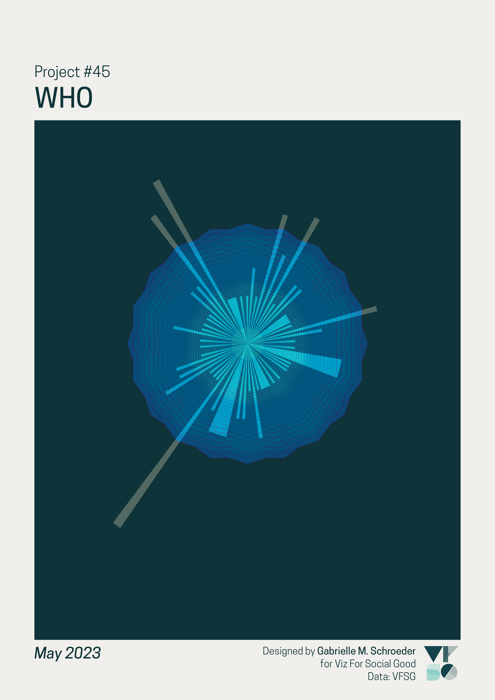
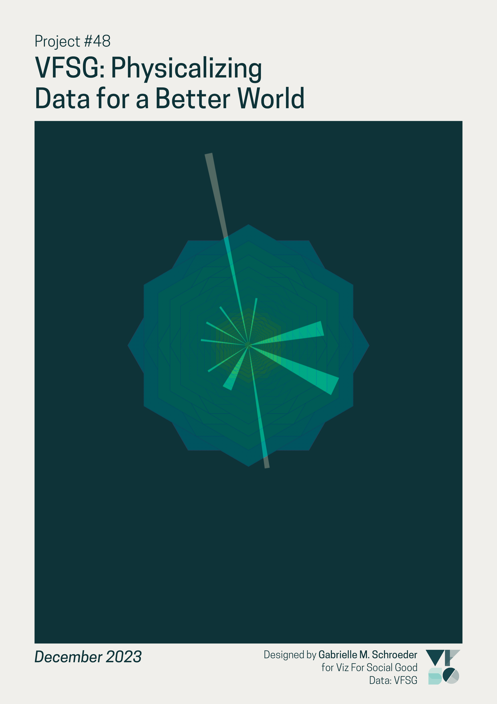

# Viz For Social Good Impact, 2017 - 2023

This Viz For Social Good (VFSG) project focused on VFSG’s own data on volunteer submissions and non-profit partners. I chose to make **data art** of each VFSG project, with the goal of creating engaging visualisations that also celebrate VFSG’s community and growth. 

I used the [projects brief's](https://www.vizforsocialgood.com/join-a-project/2024/visualizing-data-for-a-better-world) description of VFSG’s visualisations as “beacon\[s\] of change” as inspiration. For each project, the volunteers' visualisations are represented by rays of light that illuminate the mission and impact of the project’s non-profit partner (represented by the layered geometric shape).

Here are the pieces for the two projects I participated in last year:

All project visualisations are in the [vfsg_plots](https://github.com/gmschroe/vfsg-impact-2024/tree/main/vfsg_plots) folder of this repository, and I will also add them to a gallery on my website in the near future.

## How to Read

Data art is not designed to be the most effective at encoding or analysing data - for example, it’s difficult to directly compare the number of visualisations submitted for different projects using these illustrations. However, I wanted the data encoding to be apparent so each piece provides a general impression of the project's data.

Each submitted data visualisation is represented by one ray:

The corresponding non-profit for each project is represented by a geometric shape created by layering many regular polygons with the same number of sides. The number of sides is determined by the non-profit’s follower count on social media (more followers = more sides) as a rough approximation of its reach and recognisability. Smaller non-profits often benefit the most from VFSG's work since they often lack the resources for a data analysis team. 

   

*Tap Elderly Women's Wisdom for Youth, with a little over a 100 followers on Twitter (X), vs. UNICEF, with over 9 million followers.*

The colour of each shape is determined by the project’s topic. I grouped the provided topics into six broader categories:

- Education (pink/orange)
- Amplifying voices (i.e., broadcasting the work and missions of other people or organisations across multiple categories) (yellow orange)
- Infrastructure, resources, and sustainability (yellow)
- Environment and conservation (teal/green)
- Health (blue)
- Welfare, rights, and equality (purple)

Example of the each above categories, from left to right:

(proper legend for the charities TBA!)

## Additional examples

### Previous projects using VFSG data

### VFSG’s first and latest projects

### The project with the highest number of submissions

### The first project featuring presented visualisations

## Data cleaning and analysis

I used R for the data analysis and visualisations - the code is provided in this repo.

More details about data decisions TBA.
